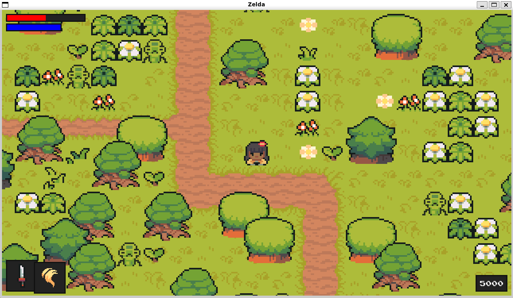

# zelda-style RPG game

> Terminal version of the game "zelda-style" written in python.


## Setup

The game and code is made to run natively on the wsl/Ubuntu platforms and Windows.

### Requirements

* python 3.9.13
* Virtually any platform including:
  * WSL/UBUNTU
  * Windows (Windows Subsystem for Linux)

### Installation

1. Open your terminal in your preferred directory and clone this project:
```sh
git clone https://github.com/IJhuang929/ZeldaStyleGameFull
```
2. Enter the project directory:
```sh
cd code
```

3. Run the program and play the game! :tada:
```sh
python main.py    
```

## Notes

此遊戲是RPG遊戲，整張地圖與障礙物已先由tile(visual level editor)先繪製而成。遊戲畫面左上角紅色長方條為血量值，藍色為魔力值。左下角方塊分別為當前使用武器與魔法。而右下角方塊是經驗值，會隨著打倒不同怪物而提升。遊戲中，透過打怪來增加經驗值調整角色素質，當血量降到0遊戲結束。

遊戲方式：
- Q鍵：換武器
- K鍵：換魔法
- 上下左右鍵：移動
- 空白鍵：施放武器
- Ctrl鍵：施放魔法
- M鍵：調整角色素質


---

